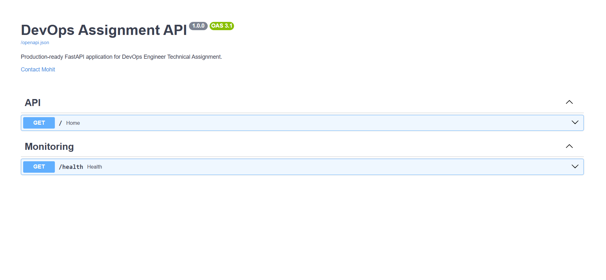
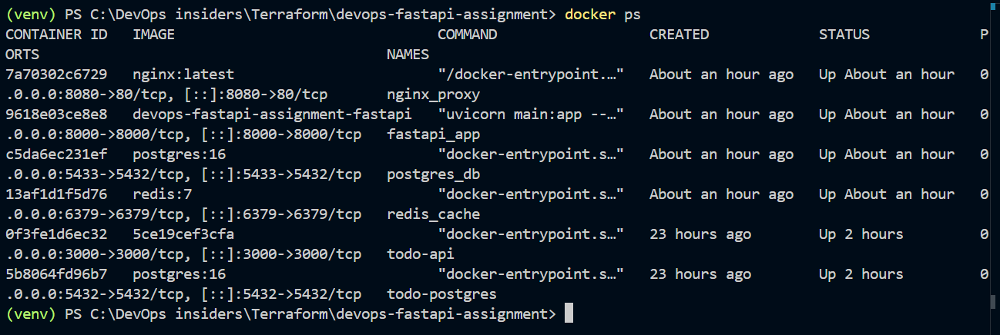
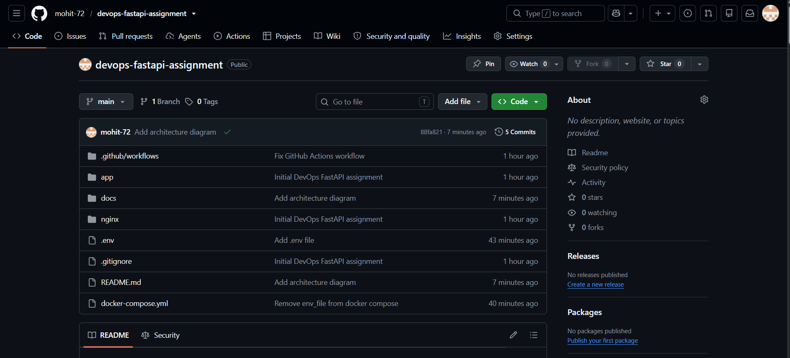

# 🚀 DevOps FastAPI Assignment


Production-ready **FastAPI** application demonstrating Docker, Docker Compose, PostgreSQL, Redis, NGINX Reverse Proxy and GitHub Actions CI/CD.

---

# 📌 Project Overview

This project was built as part of a **DevOps Engineer Technical Assignment**.

The objective was to productionize a backend application using Docker and modern DevOps practices.

The project includes:

- Dockerized FastAPI application
- Docker Compose orchestration
- PostgreSQL database
- Redis cache
- NGINX Reverse Proxy
- GitHub Actions CI pipeline
- Health Check endpoint
- Logging strategy
- Backup strategy documentation
- SSL deployment approach
- Production-ready project structure

---

# 🛠 Tech Stack

| Technology | Purpose |
|------------|---------|
| FastAPI | Backend API |
| Python 3.13 | Programming Language |
| Docker | Containerization |
| Docker Compose | Multi-container Orchestration |
| PostgreSQL 16 | Database |
| Redis 7 | Cache |
| NGINX | Reverse Proxy |
| GitHub Actions | CI Pipeline |

---

# ✨ Features

- FastAPI REST API
- Dockerized Application
- Docker Compose Setup
- PostgreSQL Integration
- Redis Integration
- NGINX Reverse Proxy
- Health Check Endpoint
- GitHub Actions CI
- Production Documentation
- Restart Policy

---

# 📂 Project Structure

```text
devops-fastapi-assignment
│
├── .github
│   └── workflows
│       └── deploy.yml
│
├── app
│   ├── Dockerfile
│   ├── main.py
│   └── requirements.txt
│
├── docs
│   ├── images
│   │   ├── architecture.png
│   │   ├── swagger-ui.png
│   │   ├── github-actions.png
│   │   └── docker-containers.png
│   │
│   ├── deployment.md
│   ├── security.md
│   ├── ssl.md
│   ├── logging.md
│   └── backup.md
│
├── nginx
│   └── nginx.conf
│
├── docker-compose.yml
├── README.md
└── .gitignore
```

---

# ⚙ Local Setup

Clone Repository

```bash
git clone https://github.com/mohit-72/devops-fastapi-assignment.git
```

Go to Project

```bash
cd devops-fastapi-assignment
```

Start Containers

```bash
docker compose up --build -d
```

Check Running Containers

```bash
docker ps
```

Stop Containers

```bash
docker compose down
```

---

# 🐳 Docker Services

| Service | Port |
|----------|------|
| NGINX | 8080 |
| FastAPI | 8000 |
| PostgreSQL | 5433 |
| Redis | 6379 |

---

# 🌐 Application URLs

### Home

```
http://localhost:8080/
```

Response

```json
{
  "message": "Welcome to DevOps FastAPI Assignment"
}
```

---

### Health Check

```
http://localhost:8080/health
```

Response

```json
{
  "status":"healthy",
  "postgres":"Connected",
  "redis":"Connected"
}
```

---

### Swagger UI

```
http://localhost:8080/docs
```

---

# ⚙ CI/CD Pipeline

GitHub Actions automatically performs the following tasks:

- Checkout Repository
- Build Docker Image
- Validate Docker Compose Configuration

Workflow File

```
.github/workflows/deploy.yml
```

> **Note:** This repository currently implements Continuous Integration (CI). In a production environment, the workflow can be extended to perform automatic deployment to a VPS or cloud server using SSH or a deployment service.

---

# 🔐 Environment Variables

```env
POSTGRES_DB=devopsdb
POSTGRES_USER=postgres
POSTGRES_PASSWORD=postgres
```

---

# 📚 Documentation

| File | Description |
|------|-------------|
| deployment.md | Deployment Guide |
| security.md | Security Measures |
| ssl.md | SSL Deployment Approach |
| logging.md | Logging Strategy |
| backup.md | Backup & Restart Strategy |

---

# 🔒 Security Measures

- Docker Container Isolation
- NGINX Reverse Proxy
- Restart Policies Enabled
- Environment Variable Support
- SSL Deployment Strategy Documented
- Production-ready Service Separation

---

# 🏗 Architecture


---

# 📸 Project Screenshots

## 📖 Swagger UI



---

## 🐳 Docker Containers



---

## ⚙ GitHub Actions



---

# 📈 Future Improvements

- VPS Deployment
- HTTPS using Let's Encrypt
- Automated CI/CD Deployment
- Prometheus & Grafana Monitoring
- Cloudflare Integration
- Automated Database Backups
- Zero-downtime Deployment
- Fail2Ban & Firewall Configuration

---

# 👨‍💻 Author

**Mohit Yadav**

GitHub:

https://github.com/mohit-72

---

# ⭐ If you like this project

Give this repository a ⭐ on GitHub.