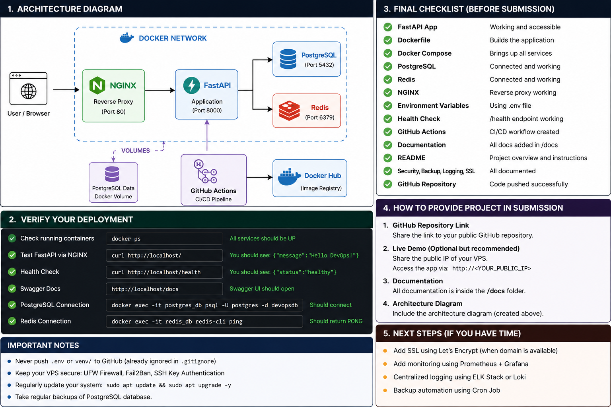

# DevOps FastAPI Assignment

## Overview

This project demonstrates a production-ready deployment of a FastAPI application using Docker and Docker Compose with PostgreSQL, Redis, NGINX reverse proxy, and GitHub Actions CI/CD.

The assignment focuses on containerization, deployment automation, infrastructure organization, security best practices, and production readiness.

---

## Tech Stack

- FastAPI
- Docker
- Docker Compose
- PostgreSQL 16
- Redis 7
- NGINX
- GitHub Actions

---

## Project Structure

```
devops-fastapi-assignment/
│
├── .github/
│   └── workflows/
│       └── deploy.yml
│
├── app/
│   ├── Dockerfile
│   ├── main.py
│   └── requirements.txt
│
├── docs/
│   ├── deployment.md
│   ├── security.md
│   ├── ssl.md
│   ├── logging.md
│   └── backup.md
│
├── nginx/
│   └── nginx.conf
│
├── docker-compose.yml
├── .gitignore
└── README.md
```

---

## Architecture



```
                 Client
                    │
                    ▼
              NGINX Reverse Proxy
                    │
                    ▼
                FastAPI App
               /           \
              ▼             ▼
       PostgreSQL         Redis
```

---

## Features

- Dockerized FastAPI application
- Docker Compose orchestration
- PostgreSQL database
- Redis cache
- NGINX reverse proxy
- Health Check endpoint
- GitHub Actions CI/CD
- Environment variable support
- Restart policy
- Production documentation

---

## Running the Application

Clone the repository

```bash
git clone https://github.com/mohit-72/devops-fastapi-assignment.git
```

Move into the project directory

```bash
cd devops-fastapi-assignment
```

Build and start containers

```bash
docker compose up --build -d
```

Check running containers

```bash
docker ps
```

Stop containers

```bash
docker compose down
```

---

## Application URLs

### Home Endpoint

```
http://localhost:8080/
```

Response

```json
{
  "message": "Welcome to DevOps FastAPI Assignment"
}
```

---

### Health Check

```
http://localhost:8080/health
```

Response

```json
{
  "status": "healthy",
  "postgres": "Connected",
  "redis": "Connected"
}
```

---

## Docker Services

| Service | Port |
|----------|------|
| NGINX | 8080 |
| FastAPI | 8000 |
| PostgreSQL | 5433 |
| Redis | 6379 |

---

## CI/CD Pipeline

GitHub Actions automatically performs the following tasks:

- Checkout repository
- Build Docker image
- Validate Docker Compose configuration

Workflow file

```
.github/workflows/deploy.yml
```

---

## Documentation

Detailed documentation is available inside the **docs** folder.

| File | Description |
|------|-------------|
| deployment.md | Deployment guide |
| security.md | Security measures |
| ssl.md | SSL approach |
| logging.md | Logging strategy |
| backup.md | Backup & restart strategy |

---

## Security Measures

- Docker container isolation
- NGINX reverse proxy
- Environment variable support
- Restart policy enabled
- SSL deployment approach documented
- Production-ready service separation

---

## Assignment Requirements Checklist

- Dockerized FastAPI Application
- Docker Compose Configuration
- PostgreSQL Service
- Redis Service
- NGINX Reverse Proxy
- Environment Variables
- SSL Documentation
- Health Check Endpoint
- Logging Strategy
- Backup Strategy Documentation
- GitHub Actions CI/CD
- Deployment Documentation

---

## Future Improvements

- Deploy on VPS
- Enable HTTPS using Let's Encrypt
- Monitoring using Prometheus & Grafana
- Automated database backups
- Zero-downtime deployments
- Cloudflare Integration

---

## Author

**Mohit**

GitHub:

https://github.com/mohit-72